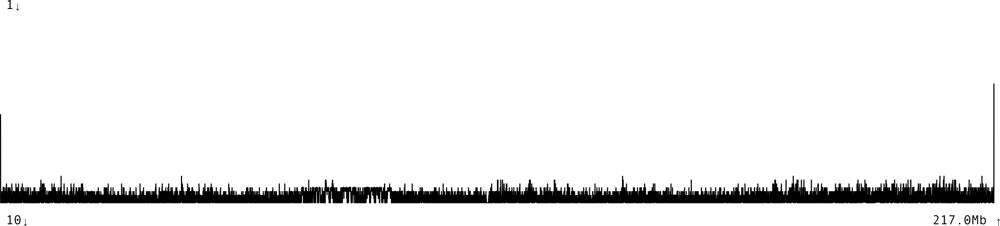
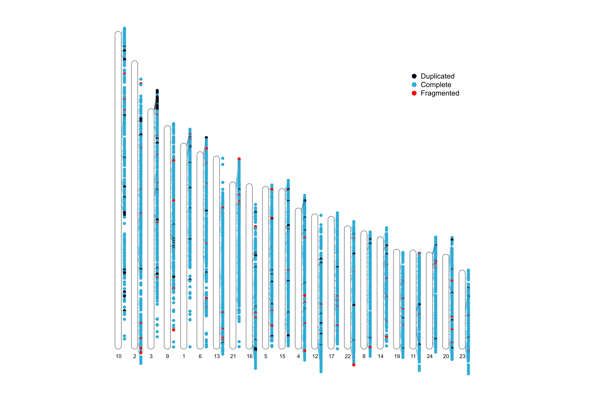
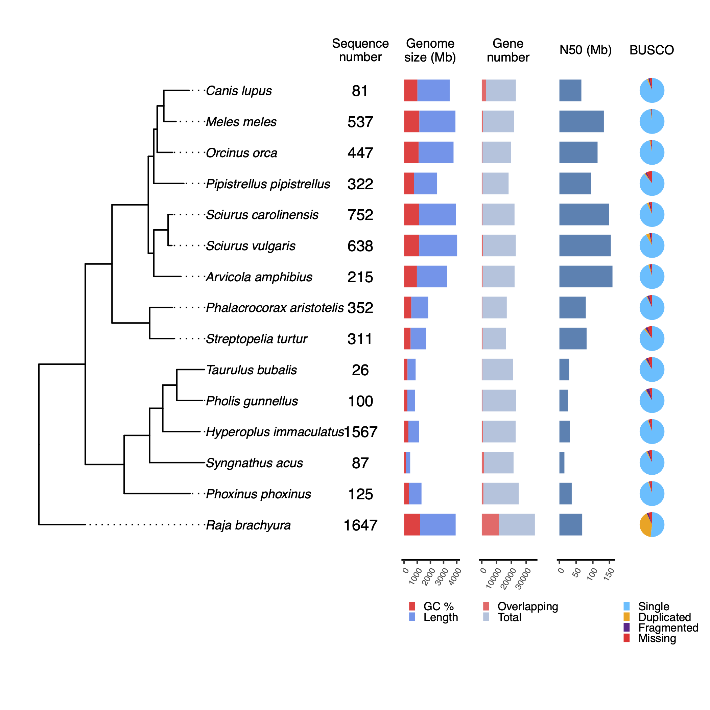
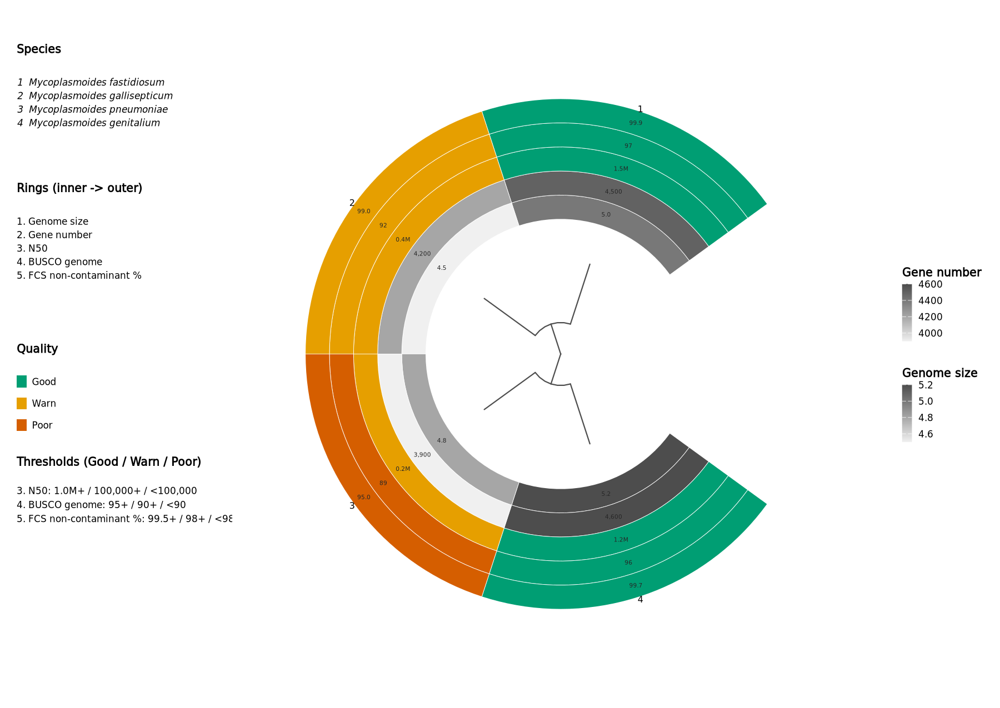
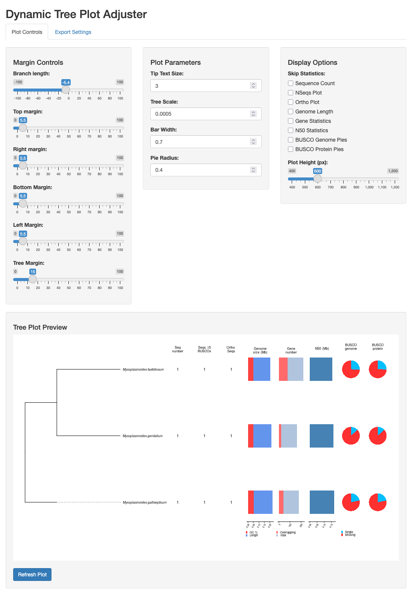

# nf-core/genomeqc: Output

## Introduction

This document describes the output produced by the nf-core/genomeqc.

The directories listed below will be created in the results directory after the pipeline has finished. All paths are relative to the top-level results directory.

## Pipeline overview

The pipeline is built using [Nextflow](https://www.nextflow.io/) and processes data using the following steps:

- [NCBI genome download](#ncbi-genome-download) - Download genomes and their annotations from RefSeq and GenBank.
- Genome quality metrics:
  - [Quast](#quast) - Genome quality and contiguity metrics.
  - [tidk](#tidk) - Identify telomeric repeats.
  - [Merqury](#merqury) - Genome completeness and accuracy based on raw sequecing k-mer counts.
- [Annotation validation](#annotation-validation) - Validate and standardise the annotation file, with AGAT (default) or GffRead (`--val_tool gffread`).
- Annotation quality metrics:
  - [AGAT sp_statistics](#agat-sp_statistics) - Gene statistics.
  - [AGAT sp_keep_longest_isoform](#agat-sp_keep_longest_isoform) - Filter longest isoform from GXF file.
  - [Gene overlaps](#gene-overlaps) - Find overlapping genes (same_strand and opposite_strand).
- [Decontamination](#decontamination):
  - [FCS-GX](#fcs-gx) - Foreign genome contamination screening.
  - [FCS-adaptor](#fcs-adaptor) - Adaptor and vector contamination screening.
  - [FCS-GX clean genome](#fcs-gx-clean-genome) - Removal of contamination from assembly.
  - [Tiara](#tiara) - Sequence classification (domain and organelle level).
- [GffRead](#gffread) - Extract longest isoform from FASTA file.
- [BUSCO](#busco) - Genome completeness based on single copy markers.
- [BUSCO seqs above threshold](#busco-seqs-above-threshold) - Count sequences with more than n complete BUSCOs.
- [TE annotation](#te-annotation) (optional) - Transposable element identification and masking.
- [Orthofinder](#orthofinder) - Phylogenetic orthology inference.
- [Ortho seq count](#ortho-seq-count) - Map orthologous genes onto sequences across assemblies.
- [Tree summary](#tree-summary) - Phylogenetic summary plot.
- [Shiny app](#shiny-app) - Dynamic tree summary plot adjuster.
- [MultiQC](#multiqc) - Aggregate report describing results and QC from the whole pipeline.
- [Pipeline information](#pipeline-information) - Report metrics generated during the workflow execution.

<!--### Pigz Uncompress

pigz is used to uncompress `.gz` input files, as some nf-core/genomeqc modules require uncompressed files as input. -->

### Decontamination

#### FCS-GX

[FCS-GX](https://github.com/ncbi/fcs/wiki/FCS-GX-quickstart) is a module in NCBI’s FCS (Foreign Contamination Screening) toolkit designed to detect contaminant sequences of foreign organisms from genome assemblies.

It generates a report with assembly sequence classifications, contamination summaries, and cleaning recommendations.

Output files

- `decontamination/fcs-gx`
  - `<assembly>_<taxid>.fcs_gx_report.txt`: Summary report with sequence classification and cleaning recommendations.
  - `<assembly>_<taxid>.taxonomy.rpt`: Detailed breakdown of sequence classification.

#### FCS-Adaptor

[FCS-Adaptor](https://github.com/ncbi/fcs/wiki/FCS-adaptor-quickstart#clean-the-genome) is part of the NCBI's FCS toolkit. It’s specifically designed to detect adaptor and vector contamination that sometimes remain in genome assemblies.

It generates a report with a list of sequences flagged as adaptor or vector matches, cleaning recommendations, and the cleaned genome assembly.

Output files

- `decontamination/fcs-adaptor`
  - `<assembly>.cleaned_sequences.fa.gz`: Genome assembly with contaminant regions removed.
  - `<assembly>.fcs_adaptor_report.txt`: Summary report with flagged sequences and cleaning recommendations.

:::note
We recommend ignoring the cleaned genome assembly output by this module, as the vector and adapter removal is done by the **FCS-GX clean genome** module (see below).
:::

#### FCS-GX clean genome

[FCS-GX clean genome]() is based on a command of the NCBI's FCS toolkit which applies the recommended cleaning actions to the genome assembly based on the screening results.

It outputs a cleaned version of the genome assembly based on the recommended actions from **FCS-GX** and **FCS-Adaptor**, with the contaminant sequences removed and sequences with local contaminants trimmed.

Output files

- `decontamination/cleaned_genome`
  - `<assembly>.cleaned.fasta`: Genome assembly with contaminant sequences removed and contaminant regions trimmed.
  - `<assembly>.contaminants.fasta`: Sequences classified as contaminants.

#### Tiara

[Tiara](https://ibe-uw.github.io/tiara/) is a deep learning–based classifier designed to identify eukaryotic, archaeal, and bacterial sequences, as well as organelle genomes.

It outputs a report with each sequence of the genome assembly labelled as Eukarya, Archea, Bacteria, organelle or unknown.

Output files

- `decontamination/tiara/raw/`
  - `<assembly>.txt`: Sequence classifications for the original (raw) assembly.
  - `log_<assembly>.txt`: Log file with classification statistics and model information.
- `decontamination/tiara/cleaned/`
  - `<assembly>.txt`: Sequence classifications for the FCS-GX cleaned assembly.
  - `log_<assembly>.txt`: Log file with classification statistics and model information.

### NCBI genome download

[NCBI genome download](https://github.com/kblin/ncbi-genome-download) is a tool for downloading assemblies from the NCBI FTP site.

It inputs RefSeq or GeneBank assembly accessions and downloads the respective assembly (RefSeq and GeneBank) and annotation (RefSeq only) in FASTA and GFF formats. If local files are provided, this step is skipped.

Output files

- `ncbigenomedownload/`
  - `<assembly>.fa.gz`: Genome assembly in FASTA format (GeneBank and RefSeq outputs).
  - `<assembly>.gff3.gz`: Annotation in GFF format (RefSeq output).

This directory will only be present if `--save_assembly` flag is set.

### Quast

[Quast](https://github.com/ablab/quast) provides different quality metrics about the genome assembly. It computes contiguity stats (N50, N90), genome size, GC% content and number of sequences.

It generates a report in different formats, as well as an HTML file with in integrated contig viewer.

Output files

- `quast/<assembly_name>/`
  - `icarus.html`: Contig viewer in HTML format
  - `report.html`: Assembly stats in HTML format
  - `report.pdf`: Assembly stats in PDF format
  - `report.tsv`: Assembly statistics in TSV format

### tidk

[tidk](https://github.com/tolkit/telomeric-identifier) is a tool to identify and visualise telomeric repeats from asseblies.

It will use a known telomeric repeat as input string, and will find occurrences of these sequence in windows across the genome.

Output files

- `tidk/<assembly_name>/explore/`
  - `<assembly_name>.tidk.explore.tsv`: k-mer frequency table used to identify the candidate telomeric repeat.
- `tidk/<assembly_name>/search/aposteriori/`
  - `<assembly_name>.tsv`: Repeat counts per window across the genome (a posteriori repeat identified by `tidk explore`).
  - `<assembly_name>.bedgraph`: Same data in bedgraph format.
- `tidk/<assembly_name>/search/apriori/<repeat>/` _(only when `--repeat` is provided)_
  - `<assembly_name>.tsv`: Repeat counts per window for the supplied a priori repeat string.
  - `<assembly_name>.bedgraph`: Same data in bedgraph format.
- `tidk/<assembly_name>/plot/aposteriori/`
  - `<assembly_name>.svg`: Plot of the a posteriori telomeric repeat distribution across the genome.
- `tidk/<assembly_name>/plot/apriori/<repeat>/` _(only when `--repeat` is provided)_
  - `<assembly_name>.svg`: Plot of the a priori telomeric repeat distribution across the genome.

### Merqury

[Merqury](https://github.com/marbl/merqury) uses k-mers from sequencing reads to evaluate the assembly quality and completness without the need of a high quality reference.

It generates a histogram relating k-mer counts in the read set to their associated counts in the assembly, as well as a completness report.

Output files

- `merqury/<assembly_name>/`
  - `<assembly>.completeness.stats`: Assembly completeness statistics.
  - `<assembly>.qv`: Assembly quality value (QV) score.
  - `<assembly>.*.qv`: Per-scaffold quality value scores.
  - `<assembly>.spectra-cn.ln.png`: Linear-scale copy-number spectrum plot.
  - `<assembly>.spectra-asm.ln.png`: Linear-scale assembly spectrum plot.
  - `<assembly>.spectra-cn.fl.png`: Full copy-number spectrum plot (optional).
  - `<assembly>.spectra-asm.fl.png`: Full assembly spectrum plot (optional).
  - `<assembly>.hapmers.blob.png`: Haplotype-specific k-mer blob plot (optional).

To run nf-core/genomeqc with merqury, the assemblie's **fastq** must be provided.

### Annotation validation

The annotation file is validated and standardised before being processed downstream, using either [AGAT](https://agat.readthedocs.io/en/latest/tools/agat_convert_sp_gxf2gxf.html) `sp_gxf2gxf` (default) or [GffRead](https://github.com/gpertea/gffread) (`--val_tool gffread`).

Output files

- `validated_gff/agat/<assembly_name>/`
  - `<assembly_name>.agat.gff`: Validated and standardised annotation file (AGAT, default).
- `validated_gff/gffread/<assembly_name>/`
  - `<assembly_name>.gff3`: Validated and standardised annotation file (GffRead, only if `--val_tool gffread` is used).

This directory is only saved if `--save_validated_annotation` is set.

:::warning
`gffread -E` strips most annotation details and can drop non-coding genes (e.g. tRNAs) entirely, undercounting genes in [AGAT sp_statistics](#agat-sp_statistics), [Gene overlaps](#gene-overlaps), and [Ortho seq count](#ortho-seq-count). This is less likely to happen with the default `--val_tool agat`.
:::

### AGAT sp_statistics

[AGAT sp_statistics](https://agat.readthedocs.io/en/latest/tools/agat_sp_statistics.html) computes several annotation metrics such as number of genes, transcripts, exons, etc.

Output files

- `agat/<assembly_name>/stats/`
  - `<assembly_name>.stats.txt`: Gene annotation statistics report.

### AGAT sp_keep_longest_isoform

[AGAT sp_keep_longest_isoform](https://agat.readthedocs.io/en/latest/tools/agat_sp_keep_longest_isoform.html) filters GXF file to keep the longest isoform per gene. Longest isoforms are recommended as input for both BUSCO and Orthofinder.

Output files

- `agat/<assembly_name>/longest_isoform/`
  - `<assembly_name>.longest.g*f`: GXF file with the longest isoform per gene.

This directory will only be present if `--save_longest_isoform` flag is set.

### Gene overlaps

**Gene overlaps** is a local module based on the R package [GenomicRanges](https://bioconductor.org/packages/release/bioc/html/GenomicRanges.html), used for manipulating genomic intervals. It finds the number of genes that are overlapping in the GXF file, which can be used as a metric to evaluate the quality of the annotation.

It outputs a brief report with information about the number of reads, the number of genes fully contained in same_strand direction and in the opposite_strand direction, and the total number of overlapping genes.

Output files

- `gene_overlaps/`
  - `<assembly_name>.counts.tsv`: Summary counts of same_strand and opposite_strand overlapping genes.

### GffRead

[GffRead](https://github.com/gpertea/gffread) extracts the protein sequences using the genome assembly and annoation as input.

Output files

- `gffread/`
  - `<assembly_name>.longest.fasta`: Report in tsv format

This directory will only be present if `--save_extracted_seqs` flag is set.

### BUSCO

[BUSCO](https://busco.ezlab.org/) is a tool for assessing the quality of assemblies based on the presence of single copy orthotologues. It computes the compleness based on evolutionarily informed expectations of gene content, whether this single copy markers are present in single copy, duplicated, fragmented or absent.

It outputs a report with completness stats, a summarized table with these stats, and an ideogram with single copy markers mapped against each sequence (chromosome, scaffold or contig).

Output files

- `busco/genome/<assembly_name>/stats/` (genome completeness) or `busco/protein/<assembly_name>/stats/` (annotation completeness, genome and annotation mode only)
  - `short_summary.specific.<busco_db>.<assembly_name>.txt`: Per-run BUSCO completeness report.
  - `<assembly_name>-<busco_db>-busco.batch_summary.txt`: Summarised completeness report.
- `busco/genome/<assembly_name>/ideogram/` _(genome only mode)_
  - `<assembly_name>_<lineage>.png`: Ideogram with the location of single-copy markers across sequences.
- `busco/protein/<assembly_name>/ideogram/` _(genome and annotation mode)_
  - `<assembly_name>.png`: Ideogram with the location of single-copy markers across sequences.

### BUSCO seqs above threshold

**BUSCO seqs above threshold** is a local module that counts, per assembly, the number of sequences (chromosomes/scaffolds/contigs) containing more than `--min_buscos` complete single-copy BUSCOs. Since single-copy BUSCOs are expected to be spread fairly evenly across the genome, this count should also be close to the assembly's chromosome number in a well-assembled genome — a much higher count suggests the BUSCO gene content is scattered across more, smaller fragments than the real karyotype, a sign of assembly fragmentation.

Output files

- `busco/genome/min_number_buscos/` (genome only mode) or `busco/protein/min_number_buscos/` (genome and annotation mode)
  - `n_seqs_above_x_buscos.tsv`: Number of sequences with Complete BUSCOs above the threshold, for every assembly run in that mode.

### TE annotation

TE annotation is optional and is enabled with `--te hite` or `--te repeatmasker`. See [usage documentation](usage.md#running-te-annotation) for full details. Enabling either method also adds a TE composition panel to the [tree summary](#tree-summary) plot.

#### HiTE

[HiTE](https://github.com/BioinformaticsToolsmith/HiTE) is a fast, alignment-free tool for TE identification and masking. It is the recommended option for quick runs or plant genomes (`--is_plant true`).

Output files

- `hite/<assembly_name>/`
  - `<assembly_name>_hite_results/` directory containing all HiTE output files, including the masked genome and identified TE families.

#### RepeatMasker

The RepeatMasker path masks the genome against the [DFAM](https://www.dfam.org) curated repeat library:

1. **famdb.py** – curated repeat library extracted from DFAM h5 partitions (downloaded when `--RM_download_db true`; use a pre-staged library instead with `--famdb_library`).
2. **Clustering** – deduplicates the library with MMseqs2 `easy-linclust` by default (`--te_clusterer`; also supports MMseqs2 `easy-cluster` or CD-HIT-EST).
3. **RepeatMasker** – soft-masks the genome.

With `--run_repeatmodeler`, [RepeatModeler](https://github.com/Dfam-consortium/RepeatModeler) is also run to build a de novo library from the genome, which is merged with the famdb library before masking. RepeatModeler employs RECON, RepeatScout and LtrHarvest/Ltr_retriever for complementary repeat boundary identification.

[RepeatMasker](https://www.repeatmasker.org) screens DNA sequences for interspersed repeats and low complexity sequences, producing a soft-masked genome and summary statistics.

Output files

- `repeatmasker/<assembly_name>/`
  - `<assembly_name>.masked` – soft-masked genome in FASTA format.
  - `<assembly_name>.out` – detailed table of repeat positions and classifications.
  - `<assembly_name>.tbl` – summary table of repeat annotation results.
  - `<assembly_name>.gff` – repeat annotations in GFF format (if produced).

### Orthofinder

[Orthofinder](https://github.com/davidemms/OrthoFinder) finds groups of orthologous genes and uses these orthologous genes for phylogenetic inference. It outputs a rooted species tree which is later used to present the quality stats of the assemblies.

The pipeline supports both OrthoFinder v2 and v3 (selected via `--ortho_version` ; default is v3). Output structure differs slightly between versions, as v3 introduces phylogenetic hierarchical orthogroup inference in addition to the classic MCL-based orthogroups.

Output files

- `orthofinder/v2/` or `orthofinder/v3/` (depending on `--ortho_version`)
  - `Orthogroups/`
    - Orthogroup assignments from MCL clustering (present in both v2 and v3).
  - `Species_Tree/`
    - Rooted species tree used for downstream quality stats, and (v3 only) node-labelled tree (`SpeciesTree_rooted_node_labels.txt`) used to identify clade IDs.
  - `Phylogenetic_Hierarchical_Orthogroups/` **(v3 only)**
    - Orthogroups inferred from gene tree analysis at each phylogenetic level in the species tree. These are more accurate than MCL-based orthogroups alone and are the recommended orthogroup set when running v3.
  - `Comparative_Genomics_Statistics/`
    - Summary statistics on orthogroup assignment, e.g. `Statistics_Overall.tsv` and `Statistics_PerSpecies.tsv`.

This directory will only be present if `--save_orthofinder_results` flag is set.

### Ortho seq count

**Ortho seq count** is a local module that maps Orthofinder's orthogroup genes onto the sequences (chromosomes/scaffolds/contigs) they are located on, then counts how often sequences pair up as orthologous across assemblies. In a well-assembled genome, this count should be close to the true chromosome number — a much higher count points to a fragmented assembly.

Output files

- `ortho_seq_count/`
  - `species_ortho_seq_count.tsv`: Per-assembly summary of orthologous sequence mappings.
  - `pairwise_ortho_seq_count.tsv`: Pairwise sequence co-occurrence counts across assemblies.
  - `debug_gene_mapping.txt`: Per-gene mapping used to build the summaries above.

### Tree summary

**Tree summary** is a local module that takes the rooted trees species from Orthofinder, as well as the ouput statistics from the mentioned tools.

The idea of the tree summary is to give some phylogenetic context to the quality stats, which might help users when evaluating the integrity of the assemblies.

The layout is set with `--tree_style`: a conventional left-to-right tree (`roundrect`, `ellipse` or `rectangular`), or `circular`, which draws the tree as a fan with each summary statistic as a concentric ring and a numbered assembly key. In the circular layout, quality metrics (sequence count, N50, BUSCO completeness/duplication, FCS-GX contamination) are scored against `--quality_preset` thresholds (overridable per-metric with `--quality_thresholds`) and drawn as a colour-blind-safe Good/Warn/Poor traffic light on the outer rings, while descriptive metrics (e.g. genome size, gene number) use a neutral grey ramp on the inner rings; a key showing the swatches and their thresholds is drawn alongside the plot. `--show_ring_values` additionally prints each value on its ring.

If [TE annotation](#te-annotation) was run (`--te hite` or `--te repeatmasker`), each genome also gets a **TE** panel: a 100%-stacked horizontal bar showing the proportion of the genome made up of each repeat category (SINE, LINE, LTR, Penelope, DNA, Rolling Circle, Unclassified, Other, and non-repetitive sequence), coloured left-to-right in the same order as the legend. The panel is omitted entirely when TE annotation wasn't run.

If [decontamination](#decontamination) was run (`--gxdb` or `--gxdb_manifest`), each genome also gets an **FCS** panel showing the percentage of the assembly flagged as foreign contamination by FCS-GX: a pie chart (non-contaminant in blue, contaminant in red, matching the BUSCO colour scheme) in the conventional layout, or a Good (≥99.5% non-contaminant) / Warn (98-99.5%) / Poor (<98%) traffic-light ring in the circular layout. The panel is omitted entirely when decontamination wasn't run.

Output files

- `tree/genome_anno/` or `tree/genome_only/`
  - `tree_plot.pdf`: Tree summary with quality statistics.
  - `tree_plot.svg`: Same plot in SVG format.
  - `tree.nw`: Rooted species tree in Newick format.
  - `*.tsv`: Summary tables used to build the plot.

The `circular` layout draws the same statistics as concentric rings instead:

### Shiny App

**The shiny app** module uses [Shiny](https://shiny.posit.co/), a package to build interactive web apps from R, to create a dynamic plot adjuster to modify the tree plot in real time. It allows to change plot parameters such as margins, branch length, text size, etc., as well as adding and removing summary statistics next to the tree tips. The modified plot can be saved as a png/svg.

The tree style (conventional or circular) is also selectable in the app. For the circular layout, this includes a ring-thickness control, a quality-preset selector (with a custom option for per-metric Good/Warn thresholds), and a toggle to print values on the rings.

The app has two tabs, the **Plot Controls** tab to adjust the plot and remove/add features, and an **Export Settings** tab, that allows to preview the plot to export, change export settings, and save the plot as plot as png/svg.

Output files

- `shiny/app/`
  - `shiny_app.sh`: excutable to run the shiny app. It can be executed it using `bash shiny_app.sh`.
  - `shiny_app.R`: script containing the code to run the app.
  - `tree_functions.R`: script containing the code with the functions used by the app.

### Reports

The pipeline summarises the results from the tools above into two reports: a HTML report and an Excel spreadsheet.

The **HTML report** is a single-file report with one tab per tool. The BUSCO, Assembly stats (Quast), Telomeres, FCS-GX, FCS-Adaptor, Tiara and Annotation stats (AGAT) tabs are only shown if the corresponding tool was run. The Telomeres tab includes a chromosome selector for assemblies with multiple sequences, and a toggle to switch between the a priori and a posteriori tidk searches when both were run. The Annotation stats tab has a feature-type selector; each feature's table lists every assembly side by side, with `NA` where an assembly doesn't have that feature type or metric. Since AGAT can reports dozens of metrics per feature type (this depedends on the annotation file), each table shows a compact default selection - use the "Show all columns" checkbox to see every metric, and, for feature types where AGAT recalculates stats with isoforms collapsed to one transcript per gene, the "Collapse isoforms" checkbox to switch views.

The **Excel report** contains the same summary statistics as separate tables. AGAT statistics are all in one `Annotation_AGAT` sheet, one table per feature type stacked vertically under a title row naming the feature - assemblies as rows and every metric as a column (unlike the HTML report, nothing is hidden by default), `NA` where an assembly doesn't have that feature type or metric.

Output files

- `report/html/`
  - `genomeqc_report.html`: Self-contained HTML report summarising the results from all the tools above.
- `report/excel/`
  - `genomeqc_tables.xlsx`: Excel spreadsheet with the same summary statistics.

### MultiQC

[MultiQC](http://multiqc.info) is a visualization tool that generates a single HTML report summarising all samples in your project. Most of the pipeline QC results are visualised in the report and further statistics are available in the report data directory.

Results generated by MultiQC collate pipeline QC from supported tools e.g. FastQC. The pipeline has special steps which also allow the software versions to be reported in the MultiQC output for future traceability. For more information about how to use MultiQC reports, see <http://multiqc.info>.

Output files

- `multiqc/`
  - `multiqc_report.html`: a standalone HTML file that can be viewed in your web browser.
  - `multiqc_data/`: directory containing parsed statistics from the different tools used in the pipeline.
  - `multiqc_plots/`: directory containing static images from the report in various formats.

### Pipeline information

[Nextflow](https://www.nextflow.io/docs/latest/tracing.html) provides excellent functionality for generating various reports relevant to the running and execution of the pipeline. This will allow you to troubleshoot errors with the running of the pipeline, and also provide you with other information such as launch commands, run times and resource usage.

Output files

- `pipeline_info/`
  - Reports generated by Nextflow: `execution_report.html`, `execution_timeline.html`, `execution_trace.txt` and `pipeline_dag.dot`/`pipeline_dag.svg`.
  - Reports generated by the pipeline: `pipeline_report.html`, `pipeline_report.txt` and `software_versions.yml`. The `pipeline_report*` files will only be present if the `--email` / `--email_on_fail` parameter's are used when running the pipeline.
  - Reformatted samplesheet files used as input to the pipeline: `samplesheet.valid.csv`.
  - Parameters used by the pipeline run: `params.json`.

